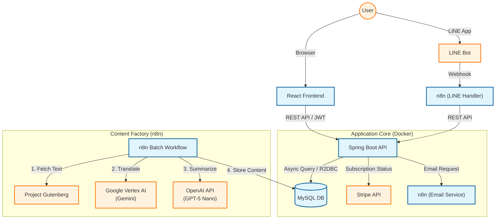

# SmartBrief (青空文庫 & 世界名作 AI要約プラットフォーム)

> **Note**
> ※本プロジェクトは、個人での商用化を目指して設計・開発・運用を行っているSaaSプロダクトです。
> **【2025/12 完成】** **メールアドレス認証、決済連携、**翻訳パイプライン、LINE連携を含む全機能の実装が完了し、**本番デプロイ済**です。
> *（Stripeの加盟店審査を正式に通過済みです。決済機能はフル実装されており、ライブAPIキーを投入するだけで、即座に収益化を開始できる状態です。）*

---

## 📖 どんなサービス？

**「名作を、10分で。」** SmartBriefは、忙しい現代人のために、青空文庫や海外の名作文学をAIが読みやすく要約・翻訳して提供する**「時短読書プラットフォーム」**です。

膨大な数の作品の中から、今の気分に合った本を瞬時に検索し、雑誌のような美しいレイアウトで要約を楽しむことができます。
また、**LINE公式アカウントとも完全連動**しており、スマホから手軽に読書体験が可能です。

### ✅ このプロジェクトで技術的に示せること

- **自動化コンテンツ工場**: n8nと**Google Vertex AI (Gemini)** を組み合わせ、海外作品の「収集 → 翻訳 → 要約 → DB格納」を行う完全自動パイプラインを構築。
- **セキュアな認証フロー**: JWT認証、環境変数による機密情報の分離に加え、**認証メールの再送機能を含む堅牢な認証フロー**を完備。
- **SaaS運用**: **Stripeサブスクリプションと連携を完了**し、決済状態（無料 / プレミアム）に基づいた厳密な権限管理と解約フローを完全自動化。
- **法規準拠**: 特定商取引法に基づく表記や利用規約を整備し、**商用利用を想定した**実運用レベルの構成。

### 🌐 ライブデモ & テストアカウント

実際に稼働しているサービスをご覧いただけます。採用担当者様向けに、機能制限のないプレミアムアカウントをご用意しました。

**URL:** <https://smartbrief.jp/>

**▼ デモ用ログイン情報**
| プラン | ユーザーID | メールアドレス | パスワード | 特徴 |
| :--- | :--- | :--- | :--- | :--- |
| **💎 Premium** | `guest_premium` | `guest.pre@example.com` | `Test@2025` | **翻訳全文・高品質要約**を含む、すべての機能が無制限で利用可能です。 |
| **🌱 Free** | `guest_free` | `guest.free@example.com` | `Test@2025` | 無料プランの挙動（**1日10回制限**やアップグレード導線）を確認できます。 |

---

## ✨ 主な機能と特徴

### 1. 読書体験を変える「AI要約 & 翻訳リーダー」

- **AI要約:** **GPT-5 Nano** が生成した高品質な要約を、**「しっぽり明朝」**フォントや余白を活かした**雑誌風のデザイン**で提供。
- **[NEW] 翻訳リーダー:** 海外のパブリックドメイン作品（O.ヘンリー等）を、**Vertex AI** が文脈を考慮して翻訳。外部サイトに飛ばず、アプリ内で完結するシームレスな読書体験を実現しました。

### 2. 自分だけの図書館「マイ・ライブラリ」

- **閲覧履歴・お気に入り:** 読んだ本や気に入った本を自動で記録し、ダッシュボードで管理できます。
- **多様な検索:** タイトル検索だけでなく、「人気ランキング」「作家一覧」「ジャンル検索」など、多角的なアプローチで本と出会えます。

### 3. 本格的な「サブスクリプション & アカウント管理」

商用利用を想定した堅牢な会員システムを実装しています。

- **認証:** ID / パスワードに加え、**厳格なメールアドレス認証フロー**を完備。ログイン時の未認証ブロックや、**認証メールの再送機能**、セキュアなパスワードリセット機能を実装。
- **権限管理:** 無料会員（1日**10冊**制限に緩和）とプレミアム会員（無制限）の厳密な出し分けを実装。**フロント側の表示制御**と**バックエンドでのアクセス制限**を併用し、スムーズな課金誘導を実現。
- **決済連携:** Stripeカスタマーポータルと連携し、ユーザー自身での解約・カード変更が可能。

### 4. LINEボット連携

Web版の機能をLINEでも利用可能です。

- **アカウント連携:** Webの会員情報とLINE IDを紐付け、課金ステータスを同期。
- **トークで読書:** 作品名を送るだけで、AI要約がトーク画面に届きます。

---

## 📸 画面イメージ

### ▼ 認証・ログイン画面（再送機能）
新規登録後、メール認証が未完了の場合に表示されます。**メール再送機能**をボタン一つで実行でき、運用レベルでのセキュリティを確保していることを示します。

### ▼ トップページ（ダッシュボード）
読みかけの本へのアクセスや、お気に入り管理、多彩な検索機能が集約されたホーム画面です。

### ▼ 詳細ページ（翻訳リーダーモード）
海外作品専用のビューアです。青空文庫へのリンクではなく、AIが翻訳した全文をアプリ内でシームレスに読むことができます。

---

## 👨‍💻 エンジニア向け技術解説 (Architecture)

### 🔥 こだわりのアーキテクチャ

#### 複合AIパイプライン (n8n + Vertex AI)

- **コンテンツ自動生成:** ユーザーのリクエスト毎に生成するのではなく、裏側の **n8n** が定期的にソースを巡回。
- **マルチモデル活用:**
    - 要約生成: **OpenAI (GPT-5 Nano)**
    - 翻訳・メタデータ生成: **Google Vertex AI (Gemini)**
- これらを使い分けることで、コストパフォーマンスと品質の最大化を実現しています。

#### 完全非同期のバックエンド (Spring WebFlux)

- Java の最新フレームワーク **Spring Boot 3 (WebFlux)** と **R2DBC** を採用。
- I/O待ちが多いAPI処理においてもスレッドをブロックしにくい構成とし、リソース効率と応答性能を意識した設計を行いました。

#### 堅牢なセキュリティと運用設計

- **JWT (JSON Web Token)** を用いたステートレス認証。
- **Cloudflare Tunnel** を使用し、自宅サーバー等の環境でもインバウンドポートを開放せずに安全に外部公開。
- **メール配信基盤:** Javaからn8nのWebhookを呼び出し、Gmail API (OAuth2) 経由でメールを配信するマイクロサービス的な疎結合構成を採用。**新規登録、再送、パスワードリセット**など、重要な通知を確実に行える基盤を構築。

---

## 🛠 使用技術スタック

| カテゴリ | 技術・ツール |
| :--- | :--- |
| **Frontend** | React, Vite, CSS Modules, React Router |
| **Backend** | Java 17, Spring Boot 3 (WebFlux), Spring Security |
| **Database** | MySQL 8.0 (Docker Container, Multi-Schema) |
| **Infra** | Docker, Docker Compose, Cloudflare Tunnel |
| **AI / Batch** | n8n, Google Vertex AI (Gemini), OpenAI API |
| **Payment** | Stripe API (Checkout & Portal) |
| **Messaging** | LINE Messaging API |

---

## 📐 システム構成図

    
🧩 詳細なシステムアーキテクチャ
より詳しい構成や設計ポリシーについては、下記ドキュメントをご覧ください。
➡ System Architecture (Public)
