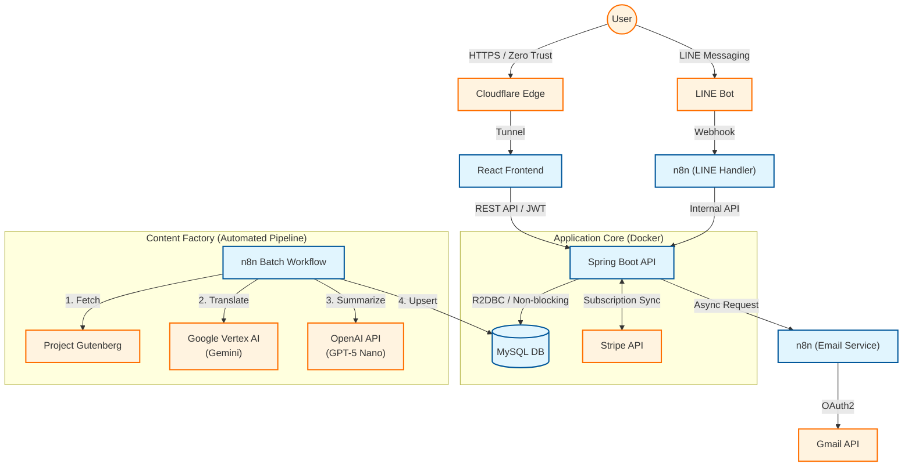

# 📚 SmartBrief - AI要約 & 翻訳SaaSプラットフォーム

> **🚀 Project Status: 完成 / 本番稼働中 (2025.12)**
>
> 本プロジェクトは、個人開発の枠を超え、**商用利用を前提としたSaaSプロダクト**として設計・開発・デプロイを完了しました。
> * **決済機能:** Stripe加盟店審査を通過済。サブスクリプション課金、Webhookによる権限自動更新、カスタマーポータルまで完全実装。
> * **セキュリティ:** Cloudflare Zero Trustによるオリジン遮蔽、JWT認証、HSTS等を完備し、外部セキュリティ評価で最高ランクを獲得。
> * **現状:** ライブAPIキーによる実課金が可能な状態で稼働しています。

---

## 📖 プロダクト概要

**「名作を、10分で。」**

SmartBriefは、忙しい現代人のために、青空文庫や海外の名作文学をAIが読みやすく要約・翻訳して提供する「時短読書プラットフォーム」です。
膨大な作品群からAIが今の気分に合った本をレコメンドし、雑誌のような美しいレイアウトで読書体験を提供します。

### 🌐 Live Demo
採用担当者様向けに、全機能（翻訳・無制限アクセス）を開放したプレミアムアカウントをご用意しました。

**URL:** <https://smartbrief.jp/>

| プラン | ID / Email | Pass | 想定利用シーン |
| :--- | :--- | :--- | :--- |
| **💎 Premium** | ID: `guest_premium` Email: `guest.pre@example.com` | `Test@2025` | **翻訳全文・高品質要約**を含む、SaaSとしてのフル機能を体験いただけます。 |
| **🌱 Free** | ID: `guest_free` Email: `guest.free@example.com` | `Test@2025` | 無料会員の制限（**1日10回制限**）や、課金へのアップグレード導線を確認できます。 |

---

## 💡 このプロジェクトの技術的ハイライト

本プロジェクトでは、単なる機能実装だけでなく、**「運用・保守・収益化」**に耐えうるシステム設計を行いました。

### 1. エンタープライズ水準のセキュリティ (Defense in Depth)
個人開発では軽視されがちなセキュリティを、商用レベルで実装しています。
- **Zero Trust Network:** Cloudflare Tunnelによりインバウンドポート（80/443含む）を全閉鎖。DDoS攻撃やポートスキャンを物理的に無効化。
- **最高評価「A+」:** Qualys SSL Labsにて最高評価を獲得。HSTS (6ヶ月)、TLS 1.3強制、CSPによるXSS対策を完備。
- **堅牢な認証フロー:** JWTによるステートレス認証に加え、メールアドレス到達確認（Verify）や再送フローを実装し、不正アカウントを排除。

### 2. 完全自動化されたコンテンツ工場 (AI Pipeline)
手動更新ゼロでコンテンツが増え続けるパイプラインを構築しました。
- **n8n + Vertex AI:** 海外パブリックドメイン作品（Project Gutenberg等）を定期巡回。
- **マルチモデル戦略:** 翻訳には文脈理解に強い **Google Vertex AI (Gemini)**、要約には **GPT-5 Nano** を使い分け、コストと品質を最適化。

### 3. 本格的なサブスクリプション基盤 (SaaS Architecture)
「決済して終わり」ではなく、ライフサイクル全体を管理しています。
- **Stripe完全連携:** Checkout（決済）だけでなく、Portal（解約・カード変更）まで実装。
- **Webhookによる即時反映:** 決済成功・失敗・解約のイベントをWebhookで検知し、DB上の権限ステータス（`Free` ⇔ `Premium`）をリアルタイムに自動更新。

---

## ✨ 主要機能

### 📱 読書体験 (Core Features)
- **AI要約リーダー:** 「しっぽり明朝」フォントや余白を計算した雑誌風UI。
- **[NEW] シームレス翻訳:** 外部サイトへ飛ばず、アプリ内でVertex AIによる翻訳全文を閲覧可能。
- **マイ・ライブラリ:** 読書履歴、お気に入り管理、多角的な検索機能。

### 💳 アカウント & 決済 (Account Management)
- **厳格な閲覧制限:** 無料会員（1日10回）とプレミアム会員の出し分けを、フロントエンド/バックエンド双方で制御。
- **セキュアな認証:** 新規登録時のメール認証ブロック、パスワードリセット機能。

### 💬 LINE連携 (Multi-Platform)
- **ID連携:** WebアカウントとLINE IDを紐付け、課金ステータスを同期。
- **トークで読書:** 作品名を送信するだけで、要約コンテンツをLINEトーク画面で返信。

---

## 👨‍💻 技術スタック & アーキテクチャ

### 🛠 Tech Stack

| カテゴリ | 技術・ツール | 選定理由 |
| :--- | :--- | :--- |
| **Backend** | **Java 21, Spring Boot 3 (WebFlux)** | ノンブロッキングI/Oによる高並列処理と、型安全性による保守性の担保。 |
| **Frontend** | **React, Vite** | 高速なレンダリングとコンポーネント指向によるUI管理。 |
| **Database** | **MySQL 8.0** (R2DBC) | リアクティブドライバーを用いた非同期DBアクセス。 |
| **Infra** | Docker, Cloudflare Tunnel | コンテナ化による可搬性と、ゼロトラストによるセキュリティ確保。 |
| **AI / Workflow** | **n8n, Vertex AI, OpenAI** | ローコードとAPIの組み合わせによる、保守性の高いバッチ処理基盤。 |
| **Payment** | **Stripe API** | 堅牢かつ拡張性の高い決済基盤。 |

### 🎨 Frontend 実装メモ

- **React 19 + React Router v7 + Vite(rolldown-vite)** でSPAを構築
- **API呼び出しの統一:** `frontend/src/utils/apiClient.js` に集約（`/api/v1`、`{ ok, status, data, message }` で返却）
- **通知の統一:** `frontend/src/contexts/ToastContext.jsx`（成功/失敗/401などをトーストで表示）
- **認証トークン:** `authToken` を localStorage に保存し、ログイン時は **localStorage先書き → state更新** でレース回避（ログイン直後にログイン画面へ戻る事象を解消）
- **401の扱い:** `apiClient` は token を削除してステータスを返し、画面側で `logout → /login` を統一的に制御

### 📐 System Architecture Diagram

Webアプリとしての応答性能を担保しつつ、裏側でAI処理やメール配信を非同期に行う**疎結合アーキテクチャ**を採用しています。

## 📸 Screen Shots

| 認証・セキュリティ | ダッシュボード |
| :---: | :---: |
|  |  |
| **メール再送機能** 到達確認を含む堅牢な認証フロー | **ホーム画面** 履歴・お気に入り・検索を集約 |

| 翻訳リーダー | モバイル対応 |
| :---: | :---: |
|  |  |
| **翻訳モード** AI翻訳によるシームレスな読書体験 | **レスポンシブ** スマホでも快適なUI設計 |

---

## 🚀 今後の展望
- **音声読み上げ機能:** Azure AI Speech等のAPIを用いたオーディオブック化
- **レコメンド精度の向上:** ベクトル検索を用いた、より文脈に近い書籍提案