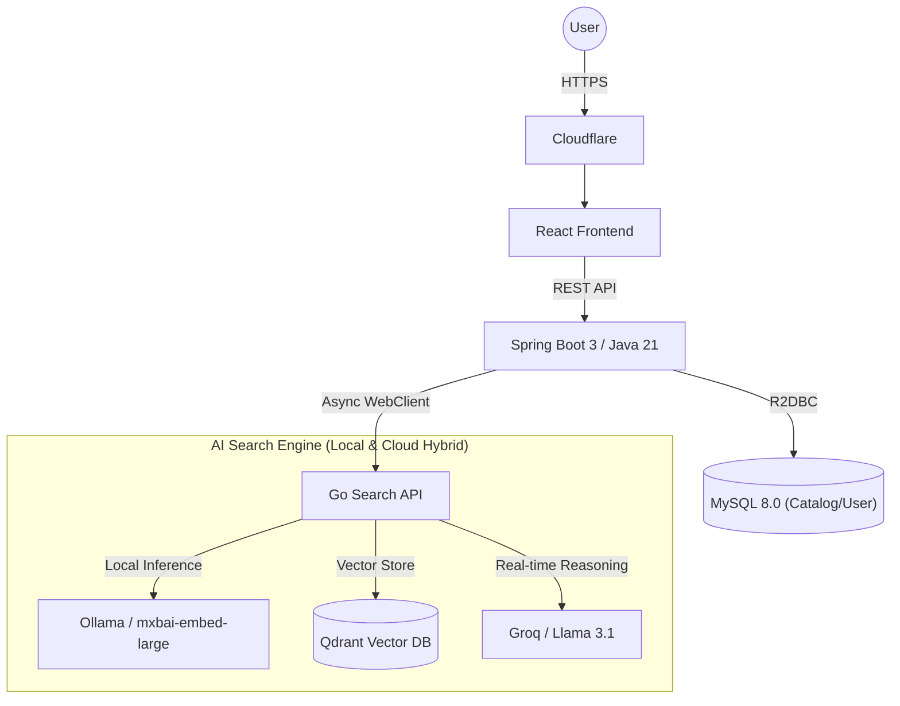

# 📚 SmartBrief - AI要約 & 翻訳SaaSプラットフォーム (v3.0)

> **🚀 Project Status: v2.0 メジャーアップデート完了 (2026.01)**
>
> 本プロジェクトは、個人開発の枠を超え、**商用利用を前提としたSaaSプロダクト**として設計・開発・デプロイを完了しました。
> 従来のキーワード検索を刷新し、
> **Gemini AIとベクトルデータベースを統合した「AI感情検索」**を実装。さらに、HttpOnly Cookieによるセキュアな認証、Stripe Webhookの冪等性担保、Goroutineによる超高速AI推論を実現し、モダンかつ堅牢なアーキテクチャを完遂しています。

---

## 📖 プロダクト概要

**「名作を、10分で。今の気分を、一言で。」**

SmartBriefは、忙しい現代人のために、青空文庫や海外の名作文学をAIが読みやすく要約・翻訳して提供する「時短読書プラットフォーム」です。
v2.0では、**「切なくて涙が出る物語」「仕事に疲れた時に勇気が出る本」**といった、ユーザーの感性に直接響く言葉で1.7万件の蔵書から最適な一冊を見つけ出し、さらに**「なぜその本が今のあなたに合うのか」をAIが瞬時に解説する**、新次元の検索体験を提供します。

### 🌐 Live Demo
採用担当者様向けに、全機能（翻訳・無制限アクセス）を開放したプレミアムアカウントをご用意しました。

**URL:** <https://smartbrief.jp/>

| プラン | ID / Email | Pass | 想定利用シーン |
| :--- | :--- | :--- | :--- |
| **💎 Premium** | Email: `guest.pre@example.com` | `Test@2025` | **AI感情検索（理由表示）・翻訳全文・高品質要約**を含むフル機能を体験いただけます。 |
| **🌱 Free** | Email: `guest.free@example.com` | `Test@2025` | 無料会員の制限（**1日10回制限**）や、課金への導線を確認できます。 |

---

## 💡 技術的ハイライト & システム設計

### 1. 🧠 Hybrid RAG: ローカルGPUとクラウドAIの融合
コストと速度を両立するため、RAG（検索拡張生成）の工程を最適化しました。
- **Local Embedding (Ollama)**: RTX 3070のGPUリソースを活用。`mxbai-embed-large`モデルを自前運用し、1.7万件の蔵書を**完全無料・プライバシー重視**でベクトル化。
- **超高速並列推論 (Groq + Go)**: 検索結果に基づく「おすすめ理由」の生成には、世界最速級の推論エンジン「Groq (Llama 3)」を採用。Goの `Goroutine` による並列処理で10冊分のAI推論を同時に行い、**わずか1秒台でユーザーへ提示**します。

### 2. 🛡️ エンタープライズ品質のセキュリティ & 決済基盤
SaaSの生命線である「認証」と「決済」を極限まで堅牢化しました。
- **XSS完全防御 (HttpOnly Secure Cookie)**: JWTトークンを `localStorage` から排除。ブラウザのセキュリティ機構（SameSite=Lax/Strict）を活用し、悪意あるスクリプトからのトークン窃取を物理的に無効化。
- **Stripeの冪等性 (Idempotency) 担保**: ネットワーク遅延等によるWebhookの重複送信に対し、DB側でイベントIDを記録して排他制御 (`@Transactional`) を実行。二重決済や不正な契約延長を100%防止。
- **Zero Trust Network**: Cloudflare Tunnelによりインバウンドポートを全閉鎖。DDoS攻撃やポートスキャンを遮断し、Qualys SSL Labsにて最高評価「A+」を獲得。

  
  
   
  <em>▲ 第三者機関（Qualys SSL Labs）による最高評価「A+」および、TLS 1.3 / HSTSの強制適用証明</em>

### 3. 🏗️ マルチ言語マイクロサービス・アーキテクチャ
役割に応じた言語選択（Polyglot）により、システム全体のパフォーマンスと保守性を最大化。
- **Go Search Microservice (Go 1.24)**: 計算資源の効率化と並列処理に長けたGo言語で、AI検索エンジンを独立。
- **Orchestration (Java 21 / Spring WebFlux)**: 認証、トランザクション、R2DBC（非同期DB）によるドメインロジックを統括。
- **Frontend (React 19 / TS / Zustand)**: コンパイル時の型安全性と、ZustandによるProp DrillingのないモダンなUI状態管理。

---

## ✨ 主要機能

### 📱 読書体験 (Core Features)
- **✨ AI感情検索 & 推論表示**: Qdrantが本を選定し、Groqが「マッチした理由」をリアルタイム生成。リッチカードとして全文表示します。
- **📖 3Dイマーシブ読書モード**: 物理的な本をめくるようなUI（ページフリップ）を実装し、没入感の高い読書体験を提供。
- **シームレス翻訳**: アプリ内でVertex AIによる翻訳全文を閲覧可能。

### 💳 サブスクリプション基盤 (SaaS Architecture)
- **Stripe完全連携**: 決済（Checkout）から解約・カード変更（Portal）まで実装。
- **リアルタイム権限更新**: 処理済みのWebhookイベントをフィルタリングし、DB上の権限（Free ⇔ Premium）を安全かつ即時に更新。

---

## 📐 System Architecture Diagram

```mermaid
graph TD
    %% 既存のアクセス層
    User((User)) -->|HTTPS| CF[Cloudflare] --> FE[React Frontend]
    FE -->|REST API| BE[Spring Boot 3 / Java 21]

    %% マイクロサービス連携
    BE -->|Async WebClient| SearchAPI[Go Search API]
    
    subgraph "AI Search Engine (Local & Cloud Hybrid)"
        SearchAPI -->|Local Inference| Ollama[Ollama / mxbai-embed-large]
        SearchAPI -->|Vector Store| Qdrant[(Qdrant Vector DB)]
        SearchAPI -->|Real-time Reasoning| Groq[Groq / Llama 3.1]
    end

    %% 既存のデータ層
    BE -->|R2DBC| MySQL[("MySQL 8.0 (Catalog/User)")]
```

## 🛠 Development Story: 挑戦とやりがい

本プロジェクトのフェーズ2における大規模改修は、単なる機能追加ではなく、**「商用クオリティの堅牢性」**と
**「持続可能なコードベース」**への昇華を目的とした、技術的な総力戦となりました。

### 1. セキュリティの追求とTypeScriptへの完全移行
当初は利便性を優先し LocalStorage + JWT で認証を実装していましたが、SaaSとしての信頼性を担保するため、XSS攻撃を物理的に遮断する **HttpOnly / Secure / SameSite=Lax Cookie** 管理への全面移行を決断しました。

- **型安全性の導入 (TS化):** 通信層の根本的な変更に伴い、データ構造の不整合を防ぐため、フロントエンドを全面的に TypeScript へ移行。数千行に及ぶプロパティ定義を厳密に管理しました。
- **ミリ単位のデバッグ:** Docker ネットワーク内での CORS 設定、Java (Spring Security) での Cookie 抽出ロジック、TS の型定義など、フロントからバックまで連動する「疎通の壁」を一つずつ突破しました。

### 2. 妥協なき「Null Safety」の追求
実行時の予期せぬクラッシュを設計段階でゼロにするため、システム全体から **Null Pointer 関連の不確実性を徹底的に排除** しました。

- **Java (Spring WebFlux):** Java 21 の `Objects.requireNonNull` や `Collectors.collectingAndThen(..., List::copyOf)` を駆使。IDE の静的解析警告を一つ残らず解消し、バックエンドの堅牢性を極限まで高めました。
- **TypeScript & Go:** フロントエンドでは厳格な型ガードを徹底。Go 側でも Qdrant ペイロードや外部 API 通信において徹底したエラーハンドリングと Null チェックを実装しました。

**「動くのは当たり前、落ちないのは技術」** という信念のもと、膨大なコンパイル警告を論理的に解消していくプロセスは、エンジニアとして最大のやり甲斐となりました。

### 3. マイクロサービス間の最適化と並列処理
- **異言語間通信の壁を突破:** Java (Spring Boot) と Go の間で発生した JSON デコードの型不整合を、`RichSearchHit` DTO の再定義と WebClient の型変換ロジックにより解決。言語の垣根を超えた安定した通信を実現しました。
- **10件のAI推論を1秒で完了:** 検索結果10件に対する「推薦理由」の生成を、Go の `Goroutine` と `sync.WaitGroup` により完全並列化。直列処理で 10秒以上かかっていたリクエスト時間を、**わずか 1秒前後（最も遅い1回分）に圧縮**し、圧倒的な UX を実現しました。

### 4. 状態管理のモダン化
機能拡張に伴う Props Drilling（バケツリレー）によるコードの複雑化に対し、**Zustand** を導入。認証状態やユーザー権限をグローバルに管理し、再レンダリングを最小限に抑えるクリーンなフロントエンドアーキテクチャを確立しました。

# 🚀 今後の展望 (Roadmap)

SaaSとしての基盤は完成しましたが、技術的探求とユーザー体験の向上は続きます。

- **🦀 Rust化への挑戦**: さらなるメモリフットプリントの削減と極限のI/O性能を追求するため、Goで実装されている検索マイクロサービスを **Rust (Tokio + Axum)** へリプレイス予定。
- **🔊 音声読み上げ機能**: Azure AI Speech等のAPIを用いたオーディオブック化。
- **⚡ Performance**: `TanStack Query (React Query)` 導入によるサーバー状態のキャッシュ管理。