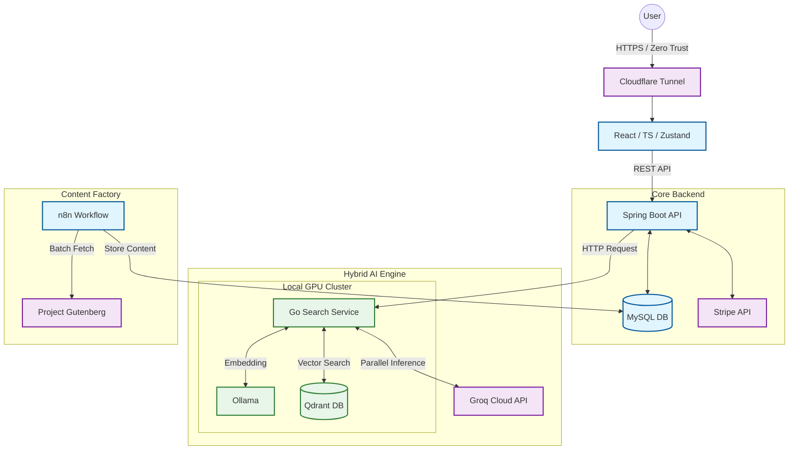

# 📚 SmartBrief - AI要約 & 翻訳SaaSプラットフォーム (v2.0)

> **🚀 Project Status: v2.0 メジャーアップデート完了 (2026.01)**
>
> 本プロジェクトは、個人開発の枠を超え、**商用利用を前提としたSaaSプロダクト**として設計・開発・デプロイを完了しました。
> 従来のキーワード検索を刷新し、**Gemini AIとベクトルデータベースを統合した「AI感情検索」**を実装。さらにTypeScript化によるフルスタックの型安全性と、Go言語（Goroutine）による超高速AI推論を実現し、モダンなアーキテクチャを完遂しています。

---

## 📖 プロダクト概要

**「名作を、10分で。今の気分を、一言で。」**

SmartBriefは、忙しい現代人のために、青空文庫や海外の名作文学をAIが読みやすく要約・翻訳して提供する「時短読書プラットフォーム」です。
v2.0では、**「切なくて涙が出る物語」「仕事に疲れた時に勇気が出る本」**といった、ユーザーの感性に直接響く言葉で1.7万件の蔵書から最適な一冊を見つけ出し、さらに**「なぜその本が今のあなたに合うのか」をAIが瞬時に解説する**、新次元の検索体験を提供します。

### 🌐 Live Demo
採用担当者様向けに、全機能（翻訳・無制限アクセス）を開放したプレミアムアカウントをご用意しました。

**URL:** <https://smartbrief.jp/>

| プラン | ID / Email | Pass | 想定利用シーン |
| :--- | :--- | :--- | :--- |
| **💎 Premium** | Email: `guest.pre@example.com` | `Test@2025` | **AI感情検索（理由表示）・翻訳全文・高品質要約**を含むフル機能を体験いただけます。 |
| **🌱 Free** | Email: `guest.free@example.com` | `Test@2025` | 無料会員の制限（**1日10回制限**）や、課金への導線を確認できます。 |

---

## 💡 技術的ハイライト & システム設計

### 1. 🧠 Hybrid RAG: ローカルGPUとクラウドAIの融合
コストと速度を両立するため、RAG（検索拡張生成）の工程を最適化しました。
- **Local Embedding (Ollama)**: RTX 3070のGPUリソースを活用。`mxbai-embed-large`モデルを自前運用し、1.7万件の蔵書を**完全無料・プライバシー重視**でベクトル化。
- **超高速並列推論 (Groq + Go)**: 検索結果に基づく「おすすめ理由」の生成には、世界最速級の推論エンジン「Groq (Llama 3)」を採用。Goの `Goroutine` による並列処理で10冊分のAI推論を同時に行い、**わずか1秒台でユーザーへ提示**します。

### 2. 🏗️ マルチ言語マイクロサービス・アーキテクチャ
システム負荷の最適化と保守性の向上のため、役割に応じた言語選択（Polyglot）を行っています。
- **Go Search Microservice (Go 1.24)**: 計算資源の効率化と並列処理に長けたGo言語を採用。Qdrant（ベクトルDB）への検索とGroq APIへの並列リクエストを統括。
- **Orchestration (Java 21 / Spring WebFlux)**: 認証・認可、MySQL連携、決済処理を統括。GoからのAIデータをR2DBCの `@Transient` を活用して既存ドメインに非侵襲でマージ（CQRSの準備）します。
- **n8n Content Factory**: n8n、Vertex AI、GPT-5 Nanoを組み合わせ、手動更新ゼロでコンテンツが増え続けるパイプラインを構築。

### 3. 🛡️ フルスタック型安全とセキュリティ
- **TypeScript & Zustand**: フロントエンドをJSからTSへ完全移行。Zustandによる状態管理でProp Drillingを解消し、コンパイル時の厳格な型安全性を確保。
- **Zero Trust Network**: Cloudflare Tunnelによりインバウンドポートを全閉鎖。DDoS攻撃やポートスキャンを物理的に無効化。
- **最高評価「A+」**: Qualys SSL Labsにて最高評価を獲得。HSTS、TLS 1.3、CSP等の高度なWebセキュリティを完備。

---

## ✨ 主要機能

### 📱 読書体験 (Core Features)
- **✨ AI感情検索 & 推論表示**: 検索クエリに基づき、Qdrantが本を選定し、Groqが「マッチした理由」をリアルタイム生成。UIにリッチカードとして全文表示します。
- **📖 3Dイマーシブ読書モード**: 物理的な本をめくるようなUI（ページフリップ）を実装し、没入感の高い読書体験を提供。
- **シームレス翻訳**: アプリ内でVertex AIによる翻訳全文を閲覧可能。

### 💳 サブスクリプション基盤 (SaaS Architecture)
- **Stripe完全連携**: 決済（Checkout）から解約・カード変更（Portal）まで実装。
- **Webhookによる即時反映**: 決済イベントを検知し、DB上の権限（Free ⇔ Premium）をリアルタイムに自動更新。

---

## 🛠 技術スタック

| カテゴリ | 技術・ツール | 選定理由 |
| :--- | :--- | :--- |
| **Backend** | **Java 21, Spring Boot 3** | WebFluxによるノンブロッキングI/Oと堅牢なセキュリティ統括。 |
| **Search (AI)** | **Go 1.24**, Ollama, Groq | Goroutineによる並列処理と、超高速推論のハイブリッド構成。 |
| **Frontend** | **React 19, TS, Zustand** | 型安全性と高度なグローバルステート管理。 |
| **Database** | **MySQL 8.0 / Qdrant** | 構造化データとベクトルデータのハイブリッド管理。 |
| **Infra** | **Docker, Cloudflare** | コンテナ化による可搬性とゼロトラストによる安全な公開。 |
| **Payment** | **Stripe API** | 堅牢かつ拡張性の高い決済基盤。 |

---

## 📐 System Architecture Diagram

```mermaid
graph TD
    User((User)) -->|HTTPS / Zero Trust| CF[Cloudflare Tunnel]
    CF --> FE[React / TS / Zustand]
    FE -->|REST API| BE[Spring Boot API]

    subgraph Core_Backend [Core Backend]
        BE <--> MySQL[(MySQL DB)]
        BE <--> Stripe[Stripe API]
    end

    subgraph Hybrid_AI_Engine [Hybrid AI Engine]
        direction TB
        BE -->|HTTP Request| GO[Go Search Service]
        GO <-->|Parallel Inference| Groq[Groq Cloud API]
        
        subgraph Local_GPU_Cluster [Local GPU Cluster]
            GO <-->|Embedding| Ollama[Ollama]
            GO <-->|Vector Search| Qdrant[(Qdrant DB)]
        end
    end

    subgraph Content_Factory [Content Factory]
        n8n[n8n Workflow] -->|Batch Fetch| Gutenberg[Project Gutenberg]
        n8n -->|Store Content| MySQL
    end

    classDef container fill:#e1f5fe,stroke:#01579b,stroke-width:2px
    classDef external fill:#f3e5f5,stroke:#7b1fa2,stroke-width:2px
    classDef local fill:#e8f5e9,stroke:#2e7d32,stroke-width:2px
    
    class FE,BE,MySQL,n8n container
    class CF,Stripe,Groq,Gutenberg external
    class GO,Ollama,Qdrant local
```

## 🛠 Development Episodes (Behind the Scenes)

### 1. 異言語間通信における「型」の壁を突破
Java (Spring Boot) と Go、二つの異なる言語をマイクロサービスとして連携させる際、JSONのデコードエラーという壁に直面しました。

* **解決**: Go側のレスポンス仕様を再定義し、Spring WebClientの強力な型変換を活用して `RichSearchHit` DTOで直接受け取ることで、異言語間の不安定な通信を完全に克服しました。

### 2. 10件のAI推論を1秒で終わらせるGoの並列処理
AI検索結果10件に対して、それぞれ「おすすめ理由」をLLMに生成させる際、直列処理では10秒以上かかりUXを損なう問題がありました。

* **解決**: Go言語の `sync.WaitGroup` と `Goroutine` を活用し、10件のAPIリクエストを完全に並列化。全体のリクエスト時間を「最も遅い1回分（約1秒）」に圧縮することに成功しました。

### 3. フロントエンドの破綻を防ぐ「型安全」と「状態管理」
機能拡張に伴い、Propsのバケツリレー（Prop Drilling）が発生し、保守性が低下していました。

* **解決**: TypeScriptへの完全移行により実行時エラーを撲滅。さらに、`Zustand` を導入して認証状態をグローバル化し、コンポーネントの再レンダリングを最小限に抑えるモダンなアーキテクチャを実現しました。

---

## 🚀 今後の展望
- **音声読み上げ機能**: Azure AI Speech等のAPIを用いたオーディオブック化。
- **コミュニティ機能**: 感想を共有し、AIが似た感性のユーザーを繋ぐSNS機能。

## 今後の改善予定 (Roadmap)
- **Security**: JWT管理を `localStorage` から `HttpOnly Secure Cookie` へ移行（XSS対策）。
- **Stability**: Stripe Webhookの重複排除（Idempotency）ロジックの導入による二重決済防止。
- **Performance**: `TanStack Query (React Query)` 導入によるサーバー状態のキャッシュ管理。