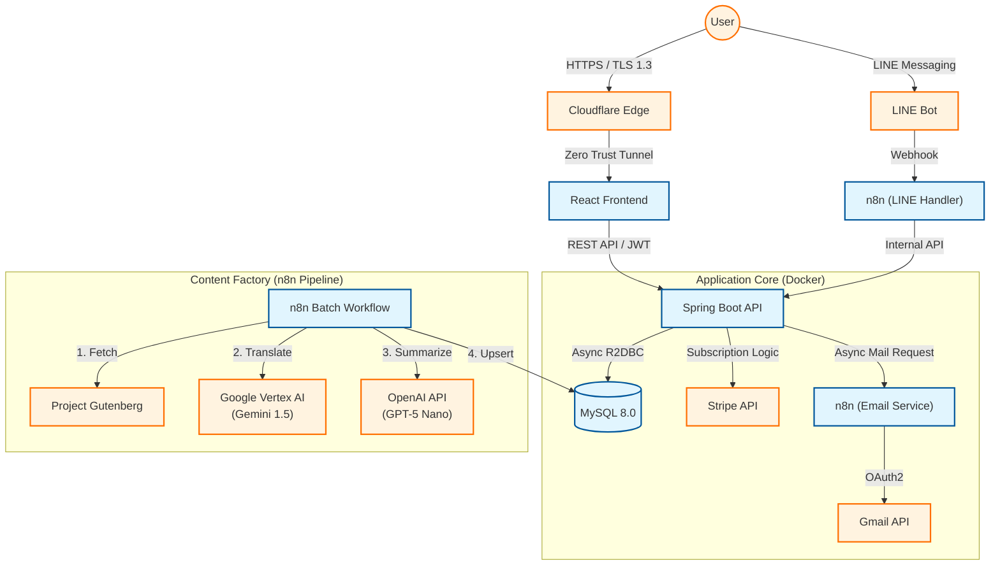

# SmartBrief System Architecture (Public Overview)

**Version:** 2.0 (Release Candidate)
**Last Updated:** 2025-12
**Status:** Production Ready

> **Note**
> 本ドキュメントは、**SmartBrief（AI要約・翻訳SaaSプラットフォーム）** の技術アーキテクチャ概要です。
> 商用運用を前提とした**セキュリティ設計（Zero Trust / HSTS）**、**決済基盤（Stripe）**、および **複合AIパイプライン** の実装詳細について記述します。

---

## 1. システム概要 (System Overview)

SmartBrief は、青空文庫および海外のパブリックドメイン作品を、現代の忙しいユーザー向けに再構築する **時短読書プラットフォーム** です。
完全非同期のバックエンド、マイクロサービス化されたAIバッチ、そして堅牢な決済・認証基盤を組み合わせ、**「読み放題SaaS」** として構築されています。

### 主な技術特性
- **High Performance:** Spring WebFlux (Non-blocking I/O) による高並列処理
- **Secure by Design:** Cloudflare Zero Trust によるオリジン遮蔽と、多層防御アーキテクチャ
- **Automated Operations:** n8n を中核とした、コンテンツ生成からメール配信までの完全自動化
- **Reliable Payment:** Stripe Webhook の冪等性を担保したサブスクリプション管理

---

## 2. アーキテクチャ (High-Level Architecture)

システム全体は Docker Compose によってコンテナ化され、責任範囲ごとに明確に分離されたマイクロサービスアーキテクチャを採用しています。

### 2.1 システム構成図

---

## 3. バックエンド設計 (Backend Design)

**Tech Stack:** Java 21, Spring Boot 3 (WebFlux), Spring Security, R2DBC

### 3.1 リアクティブ・アーキテクチャ (High Performance)
I/O待ち（DBアクセス、外部APIコール）が頻発するSaaSの特性を考慮し、スレッドをブロックしない **Non-blocking I/O** アーキテクチャを採用しています。これにより、最小限のリソースで大量の同時リクエストを処理可能です。

### 3.2 認証・認可 (Identity & Access Management)
- **Stateless Authentication:**
  - JWT (JSON Web Token) を採用し、セッションサーバーに依存しないスケーラブルな認証基盤を構築。
- **Robust Verification Flow:**
  - 仮登録 → 認証トークン発行 → メール到達確認（Verify） → 本登録 の厳格なフローを実装。
  - `is_verified` フラグによるログイン制御と、トークン有効期限管理により不正アカウントを排除。
- **Role-Based Access Control (RBAC):**
  - エンドポイントレベルで `FREE` / `PREMIUM` の権限を厳密に分離。
  - API Gateway 層（Spring Security）で認証不要パス（Webhook等）と認証必須パスをホワイトリスト形式で管理。

### 3.3 データモデル設計 (Data Modeling)
**Spring Data R2DBC** を用いた非同期データアクセス層を構築。

- **User:** 認証情報、サブスクリプション状態、Stripe Customer ID を一元管理。
- **Work:** 翻訳本文、要約（Short/Long）、メタデータを格納。
- **UserBookHistory:**
  - ユーザーごとの閲覧履歴と「本日分の閲覧回数」を管理。
  - **重複排除ロジック:** 短時間の連続アクセスを1回とみなす制御を実装し、閲覧権限の不正消費を防止。

### 3.4 決済・サブスクリプション連携 (Payment Integration)
- **Stripe Integration:**
  - Checkout Session によるセキュアなカード情報入力。
  - Billing Portal によるユーザー主導の契約変更・解約フロー。
- **Idempotency (冪等性):**
  - Stripe Webhook（`invoice.payment_succeeded` 等）処理において、イベントIDの重複チェックを実装。
  - ネットワーク遅延等によるWebhook多重送信時も、契約期間が不正延長されない堅牢なロジックを確立。

---

## 4. フロントエンド設計 (Frontend Design)

**Tech Stack:** React 19, React Router v7, Vite (rolldown-vite), CSS（global）+ theme.js

### 4.1 UX Optimization
- **Optimistic UI:** データのロード完了を待たずにスケルトンスクリーンを表示し、体感速度を向上。
- **Parallel Data Fetching:** ダッシュボード表示時に「ランキング」「新着」「履歴」のAPIを並列リクエスト（`Promise.all`）し、初期描画時間を短縮。
- **Premium Upsell UI:**
  - 無料会員が制限（10回）に達した際、専用のモーダルへ誘導。
  - 詳細画面では、テキストの一部をグラデーションで隠す「ティーザーUI」により、課金転換率（CVR）向上を狙った設計。

### 4.2 API / 通知の統一 (Consistency)

- **API Client:** `apiClient` によりAPIアクセスを統一（`/api/v1`、`{ ok, status, data, message }` の共通フォーマットで返却）。
- **Toast通知:** 成功/失敗/認証切れ（401）などのメッセージ表示をトーストに集約し、画面ごとの実装差を抑制。
- **JWTの取り扱い:** `authToken` を localStorage に保存し、APIリクエスト時は Authorization ヘッダを自動付与。
- **レース回避:** ログイン時は **localStorage先書き → state更新** の順序で反映し、ログイン直後に認証判定が先行して401になる事象を抑止。

### 4.3 Security Implementation
- **XSS対策:** React の自動エスケープ機構に加え、Content Security Policy (CSP) でスクリプト実行元を厳密に制限。
- **機密情報の保護:** LocalStorage にはパスワード等の機密情報を一切保存せず、JWTのみを管理。

---

## 5. オートメーション & AIパイプライン (Automation)

**Tech Stack:** n8n, Google Vertex AI, OpenAI API

### 5.1 コンテンツ・ファクトリー (Content Factory)
手動運用ゼロを目指し、n8n をオーケストレーターとして以下のバッチ処理を定期実行しています。

1. **Source Acquisition:** Project Gutenberg / 青空文庫からパブリックドメイン作品を自動収集。
2. **Context-Aware Translation:** 長文脈に強い **Gemini 1.5 (Vertex AI)** を使用し、作品全体のトーンを維持した自然な翻訳を実行。
3. **Summarization:** **GPT-5 Nano** により、3段階（キャッチコピー・要約・解説）のメタデータを生成。
4. **Data Upsert:** 生成結果を MySQL に格納し、即座にフロントエンドへ反映。

### 5.2 疎結合なメッセージング (Decoupled Messaging)
メール配信やLINE通知などの「副作用」を伴う処理は、メインのAPIサーバーから切り離し、n8n の Webhook へオフロード。
- **Gmail API (OAuth2)**: バックエンドからのHTTPリクエストをトリガーに、認証メールやパスワードリセットメールを即時配信。
- **LINE Messaging API**: ユーザーの操作（検索、ID連携）に対し、非同期で応答メッセージを生成・送信。

---

## 6. セキュリティとインフラ (Security & Infrastructure)

本番運用（Production）を前提とした**多層防御 (Defense in Depth)** を実装しています。

### 6.1 ネットワークセキュリティ
- **Cloudflare Zero Trust (Tunnel):**
  - オリジンサーバーのインバウンドポート（80/443含む全ポート）を物理的に閉鎖。
  - Cloudflare エッジ経由のトラフィックのみを許可し、DDoS攻撃やポートスキャンを無効化。

### 6.2 通信セキュリティ
- **Qualys SSL Labs A+ Rating:**
  - **TLS 1.3** の強制および、脆弱な暗号スイートの排除。
  - **HSTS (HTTP Strict Transport Security)** ヘッダ（max-age=6ヶ月）の付与により、中間者攻撃を防止。

### 6.3 アプリケーションセキュリティ
- **Environment Isolation:** APIキーやDBパスワードはすべて環境変数（`.env`）で注入し、コードベースから完全に分離。
- **Security Headers:**
  - `Content-Security-Policy`: XSS対策
  - `X-Content-Type-Options: nosniff`: MIMEスニフィング防止
  - `X-Frame-Options: DENY`: クリックジャッキング防止

---

### 付録: 開発・運用環境

- **Repository:** GitHub (Feature Branch Flow)
- **CI/CD:** GitHub Actions (Lint / Test / Build)
- **Monitoring:** Cloudflare Analytics, Docker Container Logs

---

*このドキュメントは外部公開用に構成された技術概要です。内部的なIPアドレス、認証キー、詳細なAPI仕様については、非公開の内部ドキュメントを参照してください。*