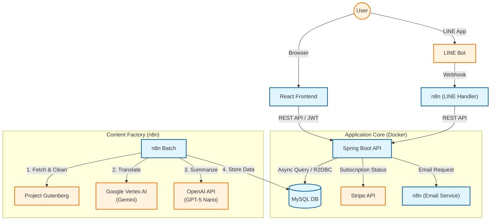

# SmartBrief System Architecture (Public Overview)

Version: 1.1

※このドキュメントは、外部公開用の技術概要です。IPアドレスや具体的な設定値など、内部運用情報は意図的に省略しています。

---

## 1. サービス概要

SmartBrief は、青空文庫および海外のパブリックドメイン作品を対象にした **AI要約・翻訳プラットフォーム** です。

- 古典文学を「約10分で読める」分量に要約・翻訳
- 検索・ランキング・お気に入り等の閲覧機能
- 無料（1日10回制限）／有料（無制限）のサブスクリプションモデル（Stripe連携）
- Webアプリ＋LINEボット連携によるマルチチャネル提供
- **メールアドレス認証**によるセキュアな本人確認

アプリケーション全体は Docker Compose を用いてコンテナ化されており、
フロントエンド・バックエンド・データベース・バッチ基盤を分離したマイクロサービス構成になっています。

---

## 2. システム構成（High-level Architecture）

### 2.1 コンポーネント一覧

**Frontend**

- React + Vite
- 認証（メール認証フロー含む）／検索／閲覧などの Web UI

**Backend API**

- Java 21 / Spring Boot 3 (WebFlux)
- 認証・権限管理（無料／プレミアムの厳密な分離）、作品閲覧制御
- メール認証トークン管理、Stripe Webhook 連携・LINE連携・履歴管理 等

**Database**

- MySQL 8.x（Dockerコンテナ）
- ユーザー情報（認証状態含む）、作品メタデータ、要約・翻訳データ、閲覧履歴、お気に入り情報 等を永続化

**Automation / Integration**

- n8n（ワークフローオーケストレーション）
- **複合AIパイプライン**: 青空文庫/Gutenbergの収集・翻訳(Vertex AI)・要約(OpenAI)バッチ
- **メール配信基盤**: ユーザー登録時の認証メール、パスワードリセットメールの送信

**Network / Edge**

- Docker Compose によるアプリケーションネットワーク
- Cloudflare Tunnel を利用した安全な外部公開
  （サーバ側で直接ポート開放を行わない構成）

### 2.2 アーキテクチャ図（概略）

---

## 3. Backend Design（Java / Spring WebFlux）

### 3.1 認証・認可

**方式**

- JWT（JSON Web Token）によるステートレス認証
- **メールアドレス認証フロー**:
  - 仮登録時に認証用トークンを発行し、メールで送信
  - 認証完了フラグ（`is_verified`）が `TRUE` でないとログイン不可
  - フロントエンドからの再送リクエストにも対応

**主な設計ポイント**

- `Authorization: Bearer <token>` ヘッダを検証
- ユーザー種別（`FREE` / `PREMIUM`）に応じたアクセス制御
- 以下をフレームワーク（ルーティング／セキュリティ設定）で明確に分離
  - 認証不要パス（ログイン、サインアップ、メール認証、再送、パスワードリセット、各種 Webhook）
  - 認証必須パス（作品閲覧・履歴／お気に入り取得など）

---

### 3.2 データモデル（概要）

主なエンティティは以下の通りです（カラム名・テーブル名は一部抽象化）。

- **User**
  - 認証情報（メールアドレス、パスワードハッシュ）
  - 認証状態（`is_verified`: boolean, `verification_token`: string）
  - 会員種別（`FREE` / `PREMIUM`）
  - サブスクリプションステータス

- **Work**
  - 作品ID、タイトル、著者名、翻訳本文、キャッチコピー
  - 要約テキスト（300文字版 / フル版）
  - カテゴリ（青空文庫 / 翻訳作品）

- **UserBookHistory**
  - ユーザーごとの作品閲覧履歴
  - 日次カウントによる「無料枠の閲覧制限（1日10回）」判定に利用
  - 重複カウント防止ロジック（短時間の連続アクセスは1回とみなす）を実装

- **UserFavorite**
  - ユーザーのお気に入り作品の管理

実装には **Spring Data R2DBC** を用いており、
リアクティブな I/O パターンを採用することで、同時接続へのスケーラビリティを意識した設計としています。

---

### 3.3 外部連携

- **Stripe**
  - サブスクリプションの購入／更新／解約イベントを Webhook で受信
  - イベント種別に応じてユーザーの会員ステータスを更新

- **LINE**
  - n8n 経由の Webhook で、ユーザーアカウントとの紐付けを実施
  - LINE 経由での閲覧時に、課金状況や無料枠を含む閲覧権限チェックを行う

- **n8n (Email Service)**
  - バックエンドからのHTTPリクエストをトリガーに、Gmail API (OAuth2) 経由でメールを送信
  - 認証メール、パスワードリセットメール等の配信基盤として利用

---

## 4. Frontend Design（React / Vite）

- 使用ライブラリ:
  - React
  - Vite
  - `react-router-dom`

**主な画面**

- 非ログインユーザー向け:
  - `/login`（ログイン・再送申請）
  - `/register`（新規登録）
  - `/verify-email`（メール認証実行）
  - `/forgot-password`, `/reset-password`
- ログインユーザー向け:
  - `/`（ダッシュボード）
  - 検索画面
  - 作品詳細画面（要約ビューア / 翻訳リーダー） など

**UX 面の工夫**

- **閲覧制限の視覚化**:
  - 無料会員が上限（10回）を超えた場合、サーバーエラーではなく専用の課金誘導モーダルを表示
  - 詳細画面では、テキストの一部をグラデーションで隠し、続きを読みたくなるようなUI設計（オーバーレイ解除）を採用
- **並列データロード**: ダッシュボード初期表示時に複数の API を並列呼び出しし、初回ロード時間を短縮

---

## 5. Automation Pipeline（n8n + AI）

SmartBrief では、作品の収集からコンテンツ生成までを **完全自動化されたパイプライン** で処理しています。

### 5.1 複合AIパイプラインのフロー

1. **収集**: Project Gutenberg / 青空文庫からテキストを取得
2. **翻訳 (Vertex AI)**: Gemini 1.5 Flash を使用し、文脈を考慮した自然な日本語へ翻訳
3. **要約 (OpenAI)**: GPT-5 Nano を使用し、要約・解説・キャッチコピーを生成
4. **保存**: 生成されたデータをデータベースへ格納（既存データの場合は更新）
5. **通知**: 必要に応じたメール通知・LINE通知

### 5.2 設計方針

- **適材適所のモデル選定**:
  - 長文翻訳にはコンテキストウィンドウの広い **Gemini (Vertex AI)**
  - 要約とキャッチコピー生成には **GPT-5 Nano**
  - これらを使い分けることで、コストと品質の最適化を実現

---

## 6. Security & Operations（概要）

- APIキーや DB 接続情報、JWT シークレットなどの機密情報は **すべて環境変数で管理** し、リポジトリにはコミットしない
- 認証不要エンドポイントと認証必須エンドポイントをフレームワーク（Spring Security 等）の設定で明確に分離
- Cloudflare Tunnel を利用し、インバウンドポートを開放せずに安全に外部公開
- コンテナオーケストレーションには **Docker Compose** を利用し、更新時はイメージ再ビルド・環境変数の適用による運用を行う

---

このドキュメントは、SmartBrief の「技術的な全体像」を外部向けに説明するためのものです。
より詳細な運用マニュアルや具体的な設定値は、非公開の内部ドキュメント側で管理しています。